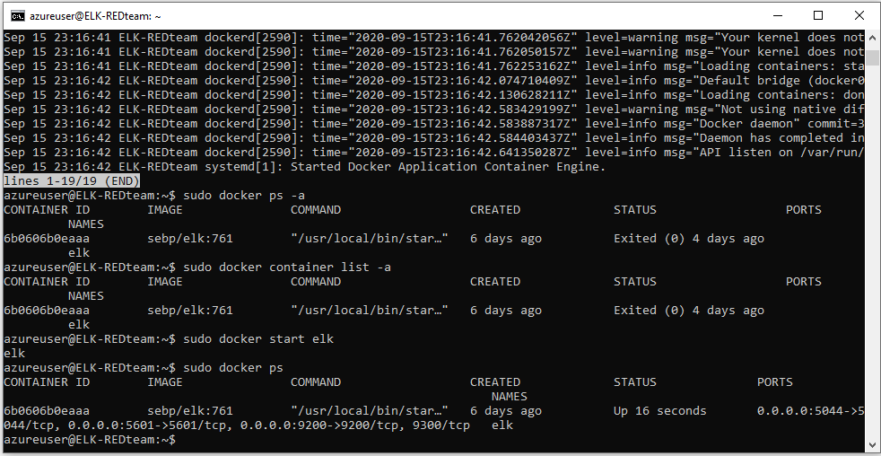

## Automated ELK Stack Deployment

The files in this repository were used to configure the network depicted below.

/Azure_Network_Map.PNG)

These files have been tested and used to generate a live ELK deployment on Azure. They can be used to either recreate the entire deployment pictured above. Alternatively, select portions of the [filebeat-playbook.yml](Ansible/filebeat-playbook.yml) file may be used to install only certain pieces of it, such as Filebeat.

This document contains the following details:
- Description of the Topologu
- Access Policies
- ELK Configuration
  - Beats in Use
  - Machines Being Monitored
- How to Use the Ansible Build

### Description of the Topology

The main purpose of this network is to expose a load-balanced and monitored instance of DVWA, the D*mn Vulnerable Web Application.

Load balancing ensures that the application will be highly available, in addition to restricting unwanted traffic to the network, a prime exapmle being a DDOS attack.

Integrating an ELK server allows users to easily monitor the vulnerable VMs for changes to the file system and machine metrics such as uptime and cpu usage.

The configuration details of each machine may be found below.

| Name     | Function  | IP Address | Operating System |
|----------|-----------|------------|------------------|
| Jump Box | Gateway   | 10.10.0.5  | Linux            |
| ELK      |ELK Server | 10.1.0.4   | Linux            |
| Web1 VM  |DVWA Server| 10.10.0.6  | Linux            |
| Web2 VM  |DVWA Server| 10.10.0.7  | Linux            |
| Web3 VM  |DVWA Server| 10.10.0.4  | Linux            |

### Access Policies

The machines on the internal network are not exposed to the public Internet. 

Only the load balancer and the jump box can accept connections from the Internet. Access to this machine is only allowed from the following IP addresses:
* 10.10.0.4
* 10.10.0.6
* 10.10.0.7

Machines within the network can only be accessed by the jump box vm running the ansible/docker containers.

A summary of the access policies in place can be found in the table below.

| Name     | Publicly Accessible | Allowed IP Addresses |
|----------|---------------------|----------------------|
| Jump Box | Yes                 | 10.0.0.1 10.0.0.2    |
|          |                     |                      |
|          |                     |                      |

### Elk Configuration

Ansible was used to automate configuration of the ELK machine. No configuration was performed manually, which is advantageous because it reduces the risk of human error if having been done manually for each container/machine.

The playbook implements the following tasks:
- _TODO: In 3-5 bullets, explain the steps of the ELK installation play. E.g., install Docker; download image; etc._
- ...
- ...

The following screenshot displays the result of running `docker ps` after successfully configuring the ELK instance.

### Target Machines & Beats
This ELK server is configured to monitor the following machines:

* Web1 VM 10.10.0.4
* Web2 VM 10.10.0.6
* Web3 VM 10.10.0.7

We have installed the following Beats on these machines:

Machines:
* Jump Box
* Elk
* Web1 VM
* Web2 VM
* Web3 VM

Beats:
* [filebeat-config.yml](Ansible/filebeat-config.yml)
* [filebeat-playbook.yml](Ansible/filebeat-playbook.yml)

These Beats allow us to collect the following information from each machine:

* The filebeat elasticach module usually deals with audit logs, deprecation logs, gc logs, server logs, and slow logs.
* The metricbeat module collects info such as cpu usage, memory, disk, network, and etc... of a system.

### Using the Playbook
In order to use the playbook, you will need to have an Ansible control node already configured. Assuming you have such a control node provisioned: 

SSH into the control node and follow the steps below:
- Copy the _____ file to _____.
- Update the _____ file to include...
- Run the playbook, and navigate to ____ to check that the installation worked as expected.

_TODO: Answer the following questions to fill in the blanks:_
- _Which file is the playbook? Where do you copy it?_
- _Which file do you update to make Ansible run the playbook on a specific machine? How do I specify which machine to install the ELK server on versus which to install Filebeat on?_
- _Which URL do you navigate to in order to check that the ELK server is running?

